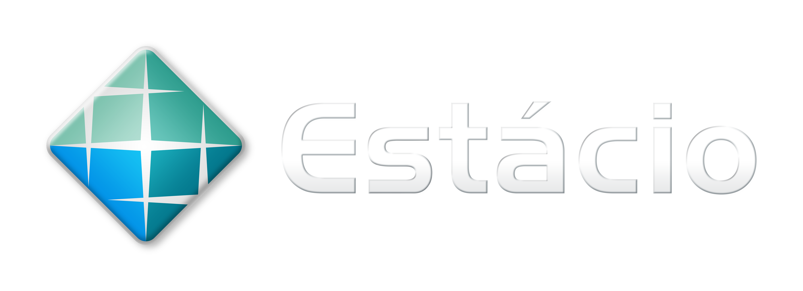

<!-- PROJECT LOGO -->

   
 
 
 

    <h1 align="center">Missão Prática 4 - Mundo 2</h1>
    <h2 align="center">Conhecendo Outro Framework</h2>
    
 Tutor(a) Simone Ingrid Monteiro Gama 

    
 Aluno: Lucas Silva Costa 

    
 Matrícula: 202208379801 

 

